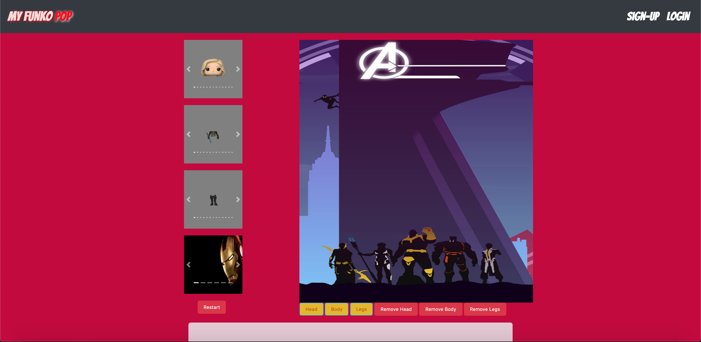
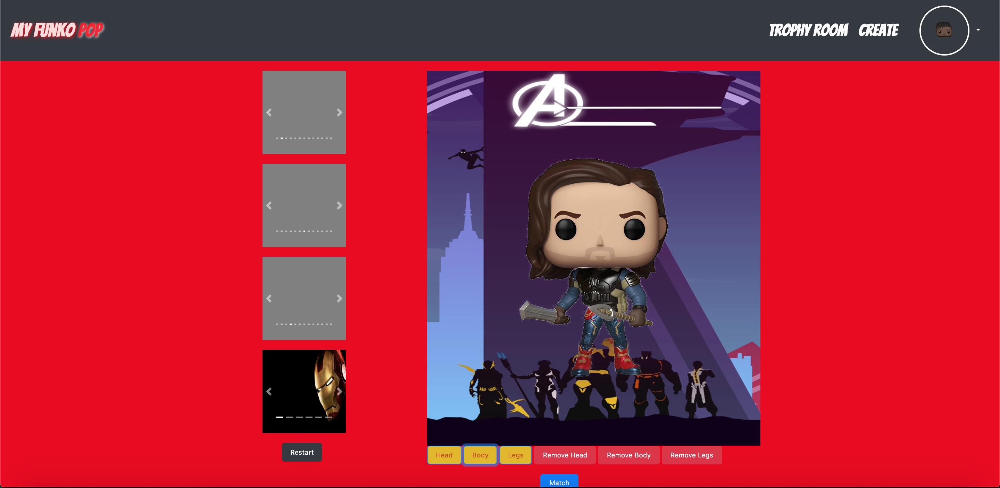
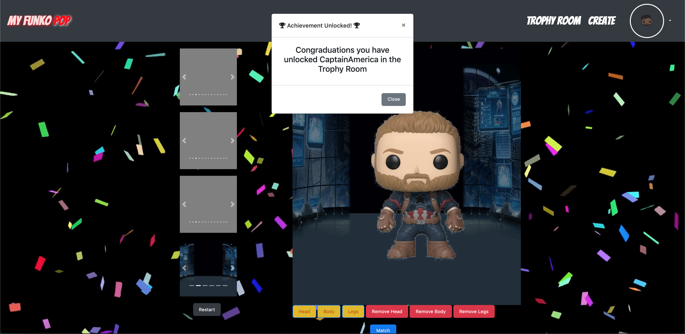

## Design your own Funko Pop

## My Funko Pop is a "build your own" site centered around your favorite collectables 
- Users can manipulate the Head, Body, and legs of their favorite Funko Pops
- Enjoy full control over your Funko with drag, drop and placement features
- Easy layout with wardrobe inspired carousels to keep the UX clean  
## My Funko Pop uses many features like
- User sign in
- Backend and session storage
- Full control over all body parts of Funkos
- Achievement system though a trophy room
- Game logic to recognize when you matched the original builds 
- Free movement using draggable widget

### My Funko Pop uses
- mysql
- express
- passport
- node
- path
- jQuery-ui
- travis for continuous integration

#### Click on the link below to build your today
[My Funko Pop](https://funky-funkos.herokuapp.com/)
